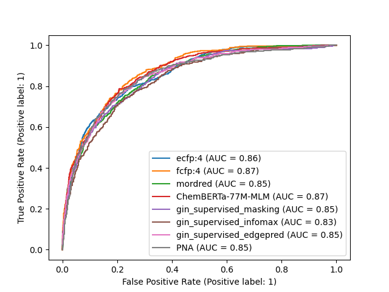
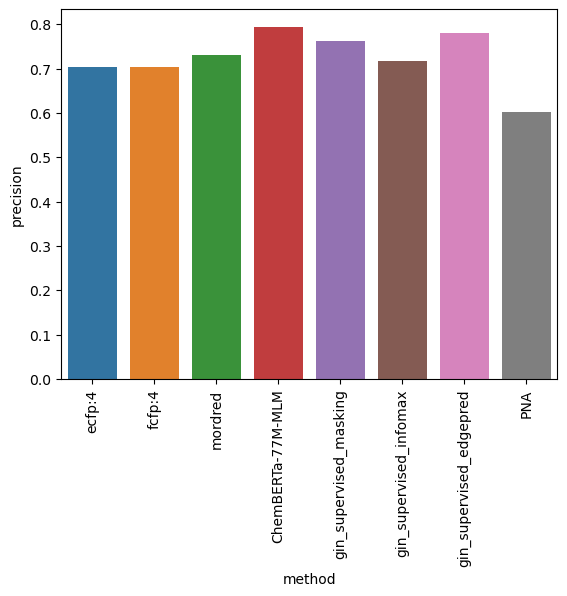
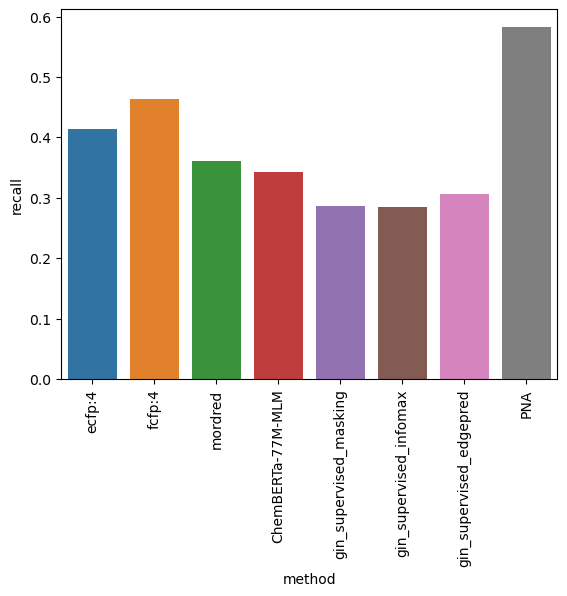
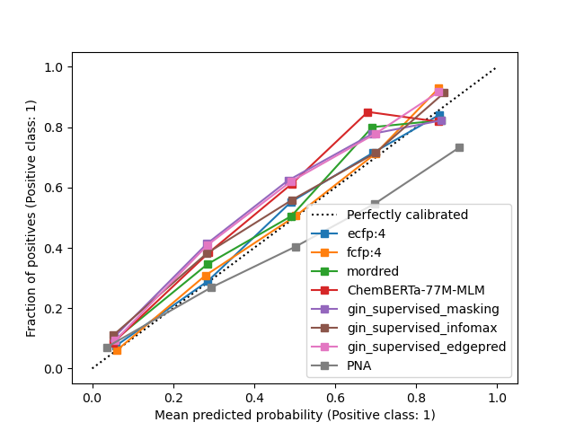

# EGFR potency prediction project
A model selection and inference pipeline to predict whether a compound can inhibit 
the activity of a target protein. In this case, we are targeting the Epidermal
Growth Factor Receptor (EGFR) kinase (a target associated with various cancers).

The dataset used for this project contains molecules along with the column pIC50. 
We want to find the molecules that have a pIC50 value superior to 8.0. To do that
we frame our task as machine learning classification task by creating the binary
target pIC50 > 8.0.

The molecules were are screening are represented by their [SMILE string representation](https://en.wikipedia.org/wiki/Simplified_molecular-input_line-entry_system).
Machine learning models only understand numerical values, so we need a way to 
transform a molecule from the SMILE representation to a numerical format.

In this project, we assessed 2 different ways to tackle the prediction task:
1. The first one is to split the work in 2 different parts:
   1. First we transform the SMILE string into a vector using either a structural 
   fingerprint, a physicochemical descriptor or a pre-trained embedding. This is 
   done thanks to the [molfeat](https://molfeat.datamol.io/) and 
   [datamol](https://datamol.io/#datamol) libraries.
   2. Then we can use any binary classifier to perform the prediction. In this case,
   we use the [catboost library](https://catboost.ai/en/docs/) from Yandex and
   more specifically their CatboostClassifier which works very well out of the box
   without any hyperparameter tuning.
2. The second approach is more end to end. We use a deep learning model and in this
case a specific Graph Neural Network (PNA). We still need a way to transform the 
molecule in numerical features but this time the transformation is made at the atoms
and bonds levels. Once again we rely on the molfeat library to encode the atom and 
the bonds into vectors that are used by the Graph Neural Network.

In the first approach, when we featurize the molecule we explicitely rely on the
expert knowledge included into the featurizers where as in the second approach, the
feature engineering is performed by the neural network.

# Installation
In order to run the code you'll first need to install the necessary dependencies which are listed in the `env.yaml` file.
We highly recommend using a package manager like mamba (See [here](https://mamba.readthedocs.io/en/latest/installation.html) for installation) or conda for this purpose.
If mamba is installed on your system, simply run the following command:
```
make install
```
This will create a conda/mamba environment named `egfr` with all dependencies installed.

You can then activate the environment with the following command:
```
mamba activate egfr
```

# Running the project
Simply type:
```
make run
```
This will trigger the training of the different pipelines and report the best one.
We have included the result of the run the notebook `final_experiments_run.ipynb` 
if you want to see the results without having to wait for it.

# Results
The most important metric we want to track for this task is the area under the ROC 
curve but we also report the precision and recall scores with a probability cut off 
of 0.5.

We attempted with the following approaches:
* Extended-connectivity fingerprints (ECFP) + Catboost
* Functional-class fingerprints (FCFPs) + Catboost
* Mordred + Catboost
* ChemBERTa-77M-MLM + Catboost
* GIN neural network model pre-trained with mutual information maximisation + Catboost
* GIN neural network model pre-trained with masked modelling + Catboost
* GIN neural network model pre-trained with supervised learning and edge prediction + Catbbost
* PNA (Graph Neural Network)

The graph deep learning model (PNA) did not outperform the combination of the morgan 
fingerprint with Catboost which achieved the best AUC on the test sets (via cross 
validation) with a mean test AUC of 0.875. We only included the PNA run with 
default parameters in the final run but we performed experimentations with 
different combination of hyperparameters (via bayesian optimisation/hyperopt) 
and different augmentation methods. The detail of these experimentations is to 
be found in the associated notebook `graph_experiments.ipynb`

## ROC curves


## Precisions


## Recalls


## Calibrations

